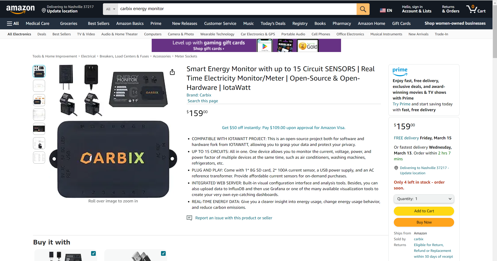

=========================================
Carbix Energy Monitor Project
=========================================

This is an open-source, open hardware project for monitoring energy,
forked from `IotaWatt <https://github.com/boblemaire/IoTaWatt>`_.
**We are committed to continuously optimizing supply chain costs to provide affordable hardware devices
and promote updates for this project.**

It can use any of dozens of common current transformers and will report the data locally via an integrated web server,
or upload to any of several third-party energy websites/databases.
Configuration and administration are through an easy-to-use browser-based utility running on a computer,
tablet, or smartphone.

CarbixEnergyMonitor is a full-function standalone energy monitor with the capability to store and
serve up to 15 years (or more) of comprehensive usage data and has an integrated web server with visualization apps.
At the same time, it can upload data to any of several (and counting) web-based databases and reporting systems.

Hardware is open and uses an ESP8266 nodeMCU, MCP3208 12-bit ADCs, an RTC, and an 8G SD card.

Metrics accumulated to 5-second resolution are Voltage(V), Power(Watts), Energy(kWh), VA, and PF.
While not certified to a standard, users typically report accuracy within 1% of their revenue meters.

Taking advantage of China's cost-effective supply chain, we will provide more reliable,
lower-priced energy monitors to quickly promote project development.
Now We sell Carbix energy monitor kit and current sensor accessories on `Amazon US <https://www.amazon.com/Monitor-CIRCUIT-Electricity-Open-Source-Open-Hardware/dp/B0CTCNH859/ref=sr_1_1?crid=GHFCVGY5C1JV&dib=eyJ2IjoiMSJ9.Ju6gpyxUTNqL_qv9ykezx-e1awh7hbRZ9p8xD7_apEs.Vw6jGimIhNebO4rCuWbQiBown-h-u4_xEG2iEEbBttw&dib_tag=se&keywords=carbix+energy+monitor&qid=1710125321&sprefix=carbix+energy+monito%2Caps%2C1449&sr=8-1>`_,
allowing users to purchase according to their needs. For this equipment,
there is still a lot of room for cost optimization, which requires us to have a certain scale effect,
and we will work hard for this.

Thanks to Bob Lemaire the founder of IotaWatt for doing such a great job, we will continue to promote the open source development of this project.

`Documentation <https://carbix-energy-monitor.readthedocs.io/en/latest/>`_

.. image:: Docs/pics/status/inputsOutputsDisplay.png
    :scale: 20 %
    :align: left

.. image:: Docs/pics/graphMultichannel.jpg
    :scale: 20 %
    :align: right

.. image:: Docs/pics/outputs/totalPowerOutput.png
    :scale: 20 %
    :align: center

.. image:: Docs/pics/PVoutput/PVoutputDisplay.png
    :scale: 20 %
    :align: center

.. image:: Docs/pics/influxDBGrafana.png
    :scale: 20 %
    :align: center